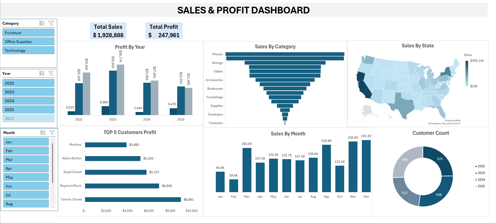

# Sales Performance Dashboard (Excel)

##Overview
This project demonstrates how to build an interactive sales performance dashboard using Microsoft Excel.

This project involves the creation of a comprehensive Sales Performance Dashboard using Microsoft Excel. The goal was to transform raw transactional data from the Superstore Sales dataset into actionable business insights. This dashboard provides a high-level overview of key performance indicators (KPIs) to help stakeholders understand revenue trends and product performance.
## Objectives
- Clean and organize raw sales data
- Summarize key metrics using pivot tables
- Visualize sales performance with clear charts
- Enable interactivity using slicers

## Tools & Skills
- Microsoft Excel
- Pivot Tables & Pivot Charts
- Data Cleaning
- Business Metrics
- Dashboard Design

- ## Key Features
- KPIs: Sales, profit
- Profit by Year
- Sales by Category
- Sales by State
- Top 5 Customer Profit
- Sales by Month
- Customer Count
- Interactive slicers (Year, Category, Month)
